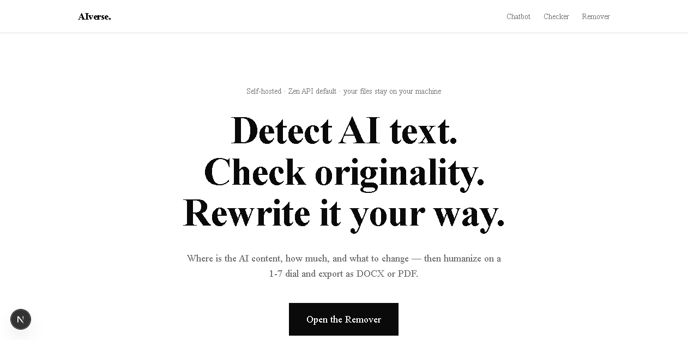
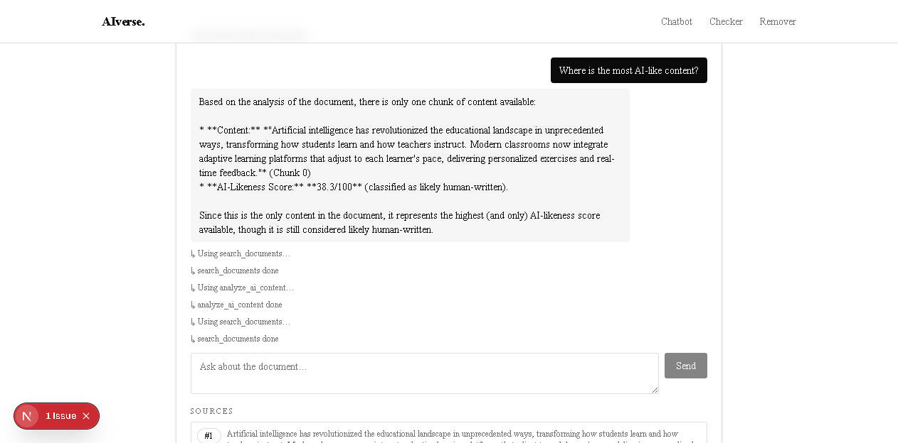
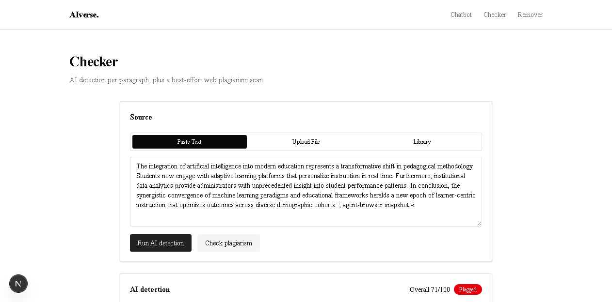
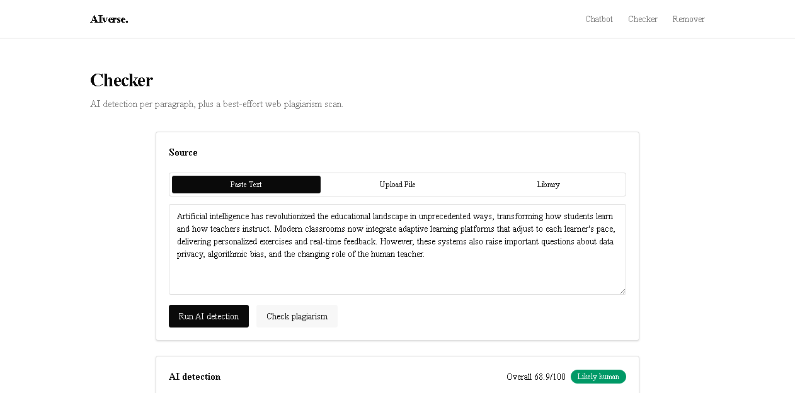
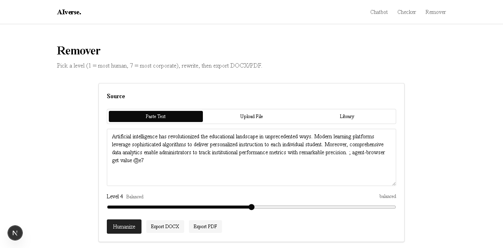

# AIverse

[](backend/pyproject.toml)
[](backend/pyproject.toml)
[](backend/pyproject.toml)
[](frontend/package.json)
[](backend/tests)
[](#license)

> *AIverse is a self-hosted AI content toolkit for anyone who needs to know whether a document sounds AI-written, whether it matches text already on the web, and how to rewrite it to sound human. It combines per-paragraph AI-likeness scoring with statistical heuristics and an LLM assessment, a best-effort web plagiarism scan, a 1–7 "humanize dial" rewriter with DOCX/PDF export, and a RAG chatbot that answers questions about your documents with cited sources. Everything runs locally on your machine: no accounts, no cloud, no lock-in — your files and a FAISS vector index stay on your disk. It is built with FastAPI, LangGraph, FAISS, and Next.js 16, and works with any of six LLM providers that auto-failover at runtime.*

## Brief description

AIverse is a self-hosted web app (backend + frontend on your machine) that answers three questions about any text: **how much of it was written by AI**, **does it match content already on the web**, and **what should it look like instead**. It targets writers, students, editors, and educators who want a private, key-flexible alternative to hosted AI-content checkers.

## Table of Contents

- [Screenshots](#screenshots)
- [Features](#features)
- [Provider auto-switch](#provider-auto-switch)
- [How detection works](#how-detection-works)
- [Tech Stack](#tech-stack)
- [Requirements](#requirements)
- [Installation](#installation)
- [Configuration](#configuration)
- [Usage](#usage)
- [API Documentation](#api-documentation)
- [Project Structure](#project-structure)
- [Testing](#testing)
- [Deployment](#deployment)
- [Contributing](#contributing)
- [License](#license)
- [TLDR](#tldr)

## Screenshots

| Landing page | Chatbot (RAG Q&A) |
|--------------|-------------------|
|  |  |

| Checker — AI detection | Checker — plagiarism scan |
|------------------------|---------------------------|
|  |  |

| Remover — humanize dial |
|-------------------------|
|  |

## Features

| Feature | Description |
|---------|-------------|
| **AI-likeness detection** (`/checker`) | Splits text into blocks and scores each 0–100 by blending statistical heuristics with an LLM assessment; returns a per-block score, reason, and change suggestion, plus an overall score with a "likely human / mixed / likely AI" verdict. |
| **Plagiarism scan** (`/checker`) | Best-effort web originality check via DuckDuckGo: each fragment is searched, matched fragments are reported with URLs and a per-fragment match verdict. No search API key needed. |
| **Humanizing remover** (`/remover`) | Rewrites AI-sounding blocks at 7 levels (1 = maximum humanizing, 7 = maximum corporate) with per-block streaming output, live analysis notes, copy-to-clipboard, and DOCX/PDF export that preserves structure. |
| **RAG chatbot** (`/chat`) | Ask questions about a pasted text or uploaded file. A LangGraph agent uses FAISS vector search (`search_documents`) and an AI-content scoring tool (`analyze_ai_content`), streams tokens + sources live, and grounds every answer in retrieved chunks. |
| **File library** | Uploaded files (`.txt`, `.md`, `.json`, `.pdf`, `.docx`; up to 20 MB) are persisted on disk, indexed for vector search, and reusable across all three tools. |
| **Provider auto-switch** | Six LLM providers with ordered runtime failover — if one is out of quota or down, the next configured provider is tried automatically (see below). |
| **Self-hosted & private** | No accounts, no database server: files, JSON manifests, and the FAISS index live under `backend/data/`. All provider keys stay in a local `.env`. |

## Provider auto-switch

Models are tried in order and automatically fall back when one fails (quota, outage, missing key):

**Groq (default) → OpenRouter → Gemini → Zen**

- `DEFAULT_PROVIDER` / `DEFAULT_MODEL` selects the primary; `FALLBACK_PROVIDER` / `FALLBACK_MODEL` the second; all other configured providers are then tried in the order above.
- Providers without an API key in `backend/.env` are skipped entirely.
- Free defaults: Groq `qwen/qwen3.6-27b`, OpenRouter `z-ai/glm-5.2:free` (override with `GROQ_MODEL` / `OPENROUTER_MODEL`).
- Supported providers: Groq, OpenRouter, Google Gemini, OpenCode Zen, OpenAI, Anthropic, and Ollama (local models).
- If *no* provider responds, the chat returns: *"We can't process your message right now because you don't have enough credits."*

## How detection works

1. **Splitting** — the source text is split into blocks (paragraph boundaries, then phrase-level for long blocks).
2. **Heuristic scoring** — each block gets a statistical AI-likeness score (burstiness, perplexity-style repetition, sentence variance; range 0–100).
3. **LLM assessment** — the block is sent to the current model with a strict rubric; the model returns a score, a short reason, and a suggested change.
4. **Blend** — heuristic and LLM scores are weighted into a final per-block score; the document overall score is the block average.
5. **Plagiarism** — up to 10-word phrases are searched via DuckDuckGo; fragments with matches are marked with URLs and a verdict (`likely original` / `possibly matched` / `likely copied`).

The checker never stores your text anywhere except your local `data/` directory.

## Tech Stack

| Category | Technology |
|----------|-----------|
| Backend | FastAPI, LangGraph, LangChain, FAISS (`faiss-cpu`), structlog, uv (Python 3.12) |
| Frontend | Next.js 16 (App Router, Turbopack), React 19, TypeScript, Tailwind CSS v4, shadcn/ui, Radix UI, TanStack Query, Zustand, Biome + ESLint, pnpm 11 |
| Embeddings | Google Gemini (`gemini-embedding-2`) via `langchain-google-genai` |
| LLM providers | Groq, OpenRouter, Google Gemini, OpenCode Zen, OpenAI, Anthropic, Ollama |
| Search (plagiarism) | DuckDuckGo HTML search (no API key) |
| Docs parsing | `pypdf`, `python-docx` |
| Export | `python-docx` (DOCX), ReportLab (PDF) |
| Testing | pytest + pytest-asyncio (backend), Biome + ESLint (frontend) |

## Requirements

- Python **>= 3.12** and [uv](https://docs.astral.sh/uv/) (backend)
- Node.js **>= 20** and pnpm **>= 9** (frontend)
- At least one LLM API key (Groq and OpenRouter both offer free tiers; see Configuration)
- Optional: Ollama (local models only)
- Windows / macOS / Linux — the dev launchers `run-backend.bat` / `run-frontend.bat` are Windows-only conveniences

## Installation

### Backend (port 8001)

```bash
cd backend
uv sync
copy .env.example .env    # Windows — or: cp .env.example .env
# edit .env and fill in at least one API key
uv run uvicorn app.main:app --app-dir src --host 127.0.0.1 --port 8001
```

### Frontend (port 3001)

```bash
cd frontend
pnpm install
copy .env.example .env.local   # NEXT_PUBLIC_API_URL=http://localhost:8001
pnpm dev -p 3001
```

### One-click (Windows)

Double-click `run-backend.bat` and `run-frontend.bat` at the repo root, then open <http://localhost:3001>.

> Note: the backend reads `.env` only at startup (`get_settings()` is cached at import) — restart the backend after any `.env` change.

## Configuration

### Backend — `backend/.env`

| Variable | Default | Description |
|----------|---------|-------------|
| `DEFAULT_PROVIDER` | `groq` | Primary LLM provider |
| `DEFAULT_MODEL` | `qwen/qwen3.6-27b` | Primary model |
| `FALLBACK_PROVIDER` | `openrouter` | Second provider in the chain |
| `FALLBACK_MODEL` | `z-ai/glm-5.2:free` | Second model |
| `TEMPERATURE` | `0.7` | LLM sampling temperature |
| `GROQ_MODEL` | `qwen/qwen3.6-27b` | Groq model (free tier) |
| `OPENROUTER_MODEL` | `z-ai/glm-5.2:free` | OpenRouter model (free tier) |
| `GROQ_API_KEY` | — | Groq key (`https://console.groq.com`) |
| `OPENROUTER_API_KEY` | — | OpenRouter key (`https://openrouter.ai`) |
| `GEMINI_API_KEY` | — | Google AI Studio key (free tier: 20 gen requests/day) |
| `ZEN_API_KEY` | — | OpenCode Zen key |
| `ZEN_BASE_URL` | `https://opencode.ai/zen/v1` | Zen endpoint |
| `OPENAI_API_KEY` | — | OpenAI key |
| `ANTHROPIC_API_KEY` | — | Anthropic key |
| `OLLAMA_BASE_URL` | `http://localhost:11434` | Local Ollama endpoint |
| `EMBEDDING_PROVIDER` | `gemini` | Embeddings provider |
| `EMBEDDING_MODEL` | `gemini-embedding-2` | Embeddings model |
| `DATA_DIR` | `./data` | Where files, manifests, and the FAISS index live |
| `CORS_ORIGINS` | `http://localhost:3001` | Comma-separated allowed origins |
| `MAX_UPLOAD_BYTES` | `20971520` | Upload size cap (20 MB) |
| `LOG_LEVEL` | `INFO` | Backend log level |

### Frontend — `frontend/.env.local`

| Variable | Default | Description |
|----------|---------|-------------|
| `NEXT_PUBLIC_API_URL` | `http://localhost:8001` | Backend base URL used by the UI |

## Usage

1. Open <http://localhost:3001>.
2. **Chatbot** — paste text or upload a file, then ask questions; the agent streams its answer and lists the source chunks it used.
3. **Checker** — paste text (or reuse an uploaded file) and click **Run AI detection** for per-block scores; click **Check plagiarism** for the web scan.
4. **Remover** — pick a humanize level on the 1–7 dial, click **Humanize**, watch blocks stream out, then **Copy**, **DOCX**, or **PDF**.

Tip: the frontend's own API URL is configurable, so you can point the UI at a backend on another machine by editing `frontend/.env.local`.

## API Documentation

All endpoints return Server-Sent Events (`text/event-stream`), each frame a JSON line `data: { "event": ..., "data": ... }\n\n`, except `/health`, `/api/files`, and `/api/export` which are plain JSON/file responses.

| Method | Endpoint | Description |
|--------|----------|-------------|
| `GET` | `/health` | Liveness probe (`{"status": "ok"}`) |
| `POST` | `/api/chat` | RAG Q&A — SSE stream |
| `POST` | `/api/detect` | AI-likeness detection — SSE stream |
| `POST` | `/api/plagiarism` | Web plagiarism scan — SSE stream |
| `POST` | `/api/humanize` | Humanizing rewrite — SSE stream |
| `POST` | `/api/export` | Download rewritten text as DOCX/PDF |
| `GET` | `/api/files` | List uploaded files |
| `POST` | `/api/files` | Upload a file (multipart) |
| `DELETE` | `/api/files/{file_id}` | Delete an uploaded file |

### SSE event contract

| Endpoint | Events (in order) |
|----------|-------------------|
| `/api/chat` | `meta` → `tool_start` / `tool_end` (per tool call) → `token`* → `sources` → `done` |
| `/api/detect` | `meta` → `block_score`* → `done` |
| `/api/plagiarism` | `meta` → `fragment`* → `done` |
| `/api/humanize` | `meta` → `block_start` → `token`* → `block_end`* → `done` |

`*` = repeated. `done` always carries the final payload (e.g. `{"answer", "events"}` for chat, `{"overall", "verdict", "blocks"}` for detect).

### Example — chat request

```bash
curl -N -X POST http://localhost:8001/api/chat \
  -H "Content-Type: application/json" \
  -d '{"source": {"text": "Artificial intelligence has revolutionized education."}, "question": "Summarize the key points."}'
```

```text
data: {"event": "meta", "data": {"document": "…", "mode": "rag", "chain": ["groq", "openrouter"]}}
data: {"event": "tool_start", "data": {"tool": "search_documents"}}
data: {"event": "tool_end", "data": {"tool": "search_documents", "ok": true}}
data: {"event": "token", "data": {"token": "Based"}}
data: {"event": "sources", "data": {"items": [{"block_index": 0, "score": 0.558, "excerpt": "…"}]}}
data: {"event": "done", "data": {"answer": "Based on the document, …", "events": 274}}
```

## Project Structure

```
AIverse/
├── backend/
│   ├── src/app/
│   │   ├── agents/        # LangGraph agent graph (chat)
│   │   ├── core/          # settings (config.py), LLM factory + provider chain (llm.py)
│   │   ├── routers/       # /health, /api/chat, /api/detect, /api/plagiarism, /api/humanize, /api/export, /api/files
│   │   ├── schemas/       # request/response models
│   │   └── services/      # detect_service, rag_service, humanize_service, plagiarism_service, file_service
│   ├── tests/             # 72 tests (pytest + pytest-asyncio)
│   ├── data/              # runtime: uploads/, vectorstore/ (gitignored)
│   ├── pyproject.toml     # uv project, ruff + mypy + pytest config
│   └── .env / .env.example
├── frontend/
│   ├── src/
│   │   ├── app/           # /, /chat, /checker, /remover (App Router pages)
│   │   ├── components/    # nav, source-picker, chat/checker/remover clients, ui/ (shadcn)
│   │   └── lib/           # api.ts (SSE client), utils
│   ├── next.config.ts     # standalone output, dev indicators off
│   └── package.json
├── sdd/                   # spec-driven docs: SPEC, PRD, SRS, SDS, TECH_STACK, BUILD_PLAN
├── imgs/                  # live screenshots (used by this README)
├── run-backend.bat        # one-click backend launcher
├── run-frontend.bat       # one-click frontend launcher
└── PROJECT_REPORT.md / .docx   # generated project report
```

## Testing

```bash
# backend — lint + full suite
cd backend && uv run ruff check src && uv run pytest

# frontend — lint + production build
cd frontend && pnpm lint && pnpm build
```

The backend suite covers providers/chain logic, detection math, humanize levels, export round-trips, file service, and router behavior (72 tests, all offline — no API keys needed). A `smoke` marker exists for live-network tests (skipped by default).

## Deployment

### Local / self-hosted

Run the two dev servers (see Installation) or build the frontend for production:

```bash
cd frontend && pnpm build && pnpm start -p 3001
cd backend && uv run uvicorn app.main:app --app-dir src --host 0.0.0.0 --port 8001
```

Point `NEXT_PUBLIC_API_URL` at the backend's reachable address. The backend is stateless regarding content — `backend/data/` is the only directory that needs persisting.

### Docker

Containerization is planned but not yet shipped (see Roadmap).

## Contributing

This is a personal project, but contributions are welcome: open an issue or PR for bugs, provider support, or better detection heuristics. Spec-driven docs live in `sdd/` and should stay in sync with code changes.

## License

No license file is present — the project is currently **UNLICENSED** (all rights reserved). Contact the author before reuse.

## TLDR

> **TLDR:** AIverse is a self-hosted toolkit that detects AI-written content per paragraph, checks originality against the web, rewrites text on a 1–7 humanize dial with DOCX/PDF export, and answers questions about your documents via a RAG chatbot. The backend is FastAPI + LangGraph + FAISS on Python 3.12; the frontend is Next.js 16 with React 19 and Tailwind. It auto-failovers across six LLM providers (Groq, OpenRouter, Gemini, Zen, OpenAI/Anthropic, Ollama) so it works with any key you have, and stores everything locally under `backend/data/`. Setup takes about 5 minutes: `uv sync`, `pnpm install`, fill in one API key, and run the two batch files.